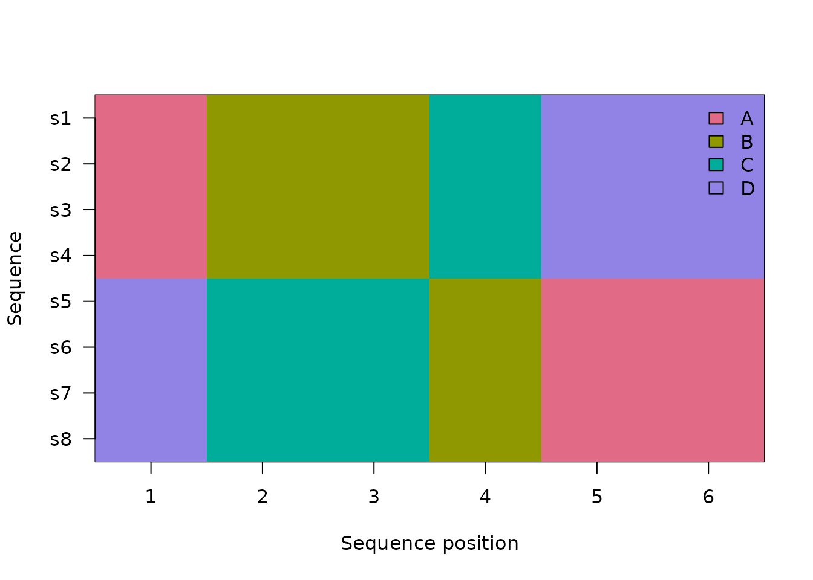
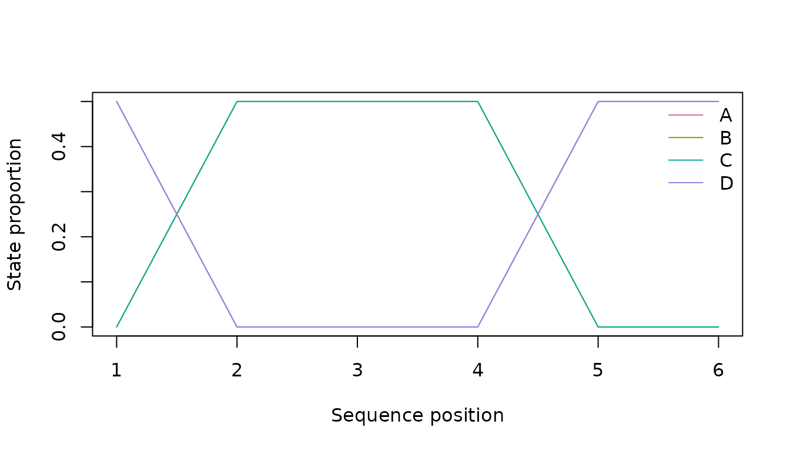
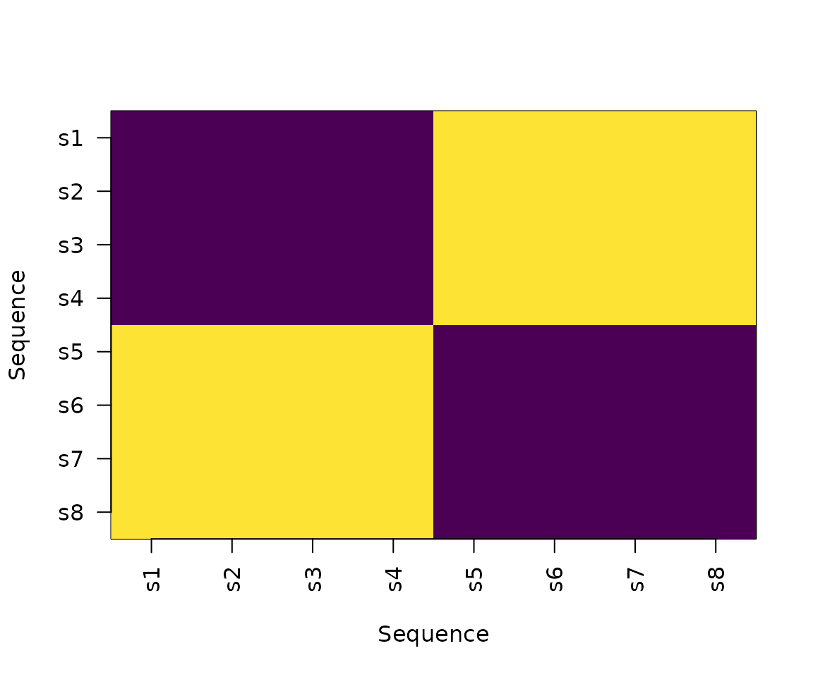
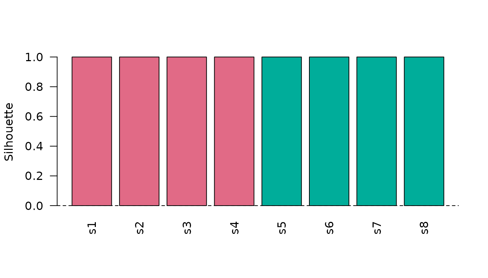
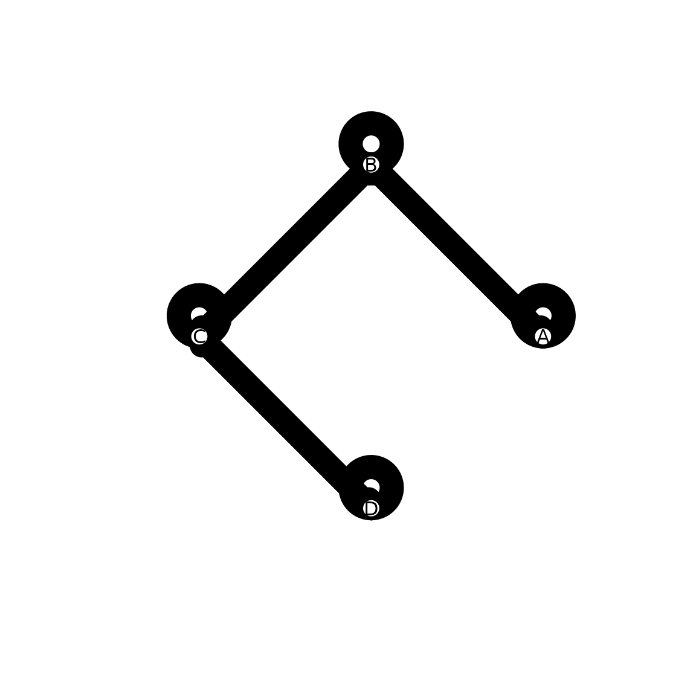

# Extended Sequence Visualisations

## Synthetic data

``` r

data <- data.frame(
  sequence_id = rep(paste0("s", 1:8), each = 6L),
  sequence_order = rep(1:6, times = 8L),
  state = c(
    rep(c("A", "B", "B", "C", "D", "D"), 4L),
    rep(c("D", "C", "C", "B", "A", "A"), 4L)
  ),
  stringsAsFactors = FALSE
)
distance <- compute_sequence_distance(data, method = "levenshtein")
clustering <- cluster_sequences(distance, k = 2L, method = "hierarchical")
network <- create_transition_network(data)
```

## Sequence index

``` r

plot_sequence_index(data)
```



## State distribution and entropy

``` r

plot_sequence_state_distribution(data)
```



``` r

plot_sequence_entropy(data)
```


Entropy is a structural diversity summary at each aligned position. It
is not a measure of participant uncertainty or cognition.

## Distance and clustering diagnostics

``` r

plot_sequence_distance_heatmap(distance)
```



``` r

plot_sequence_cluster_silhouette(clustering, distance)
```



## Transition network

``` r

plot_transition_network(network)
```



These base-R plots are intentionally focused on package-native audited
objects. They complement, rather than replace, specialist visualisation
ecosystems.
