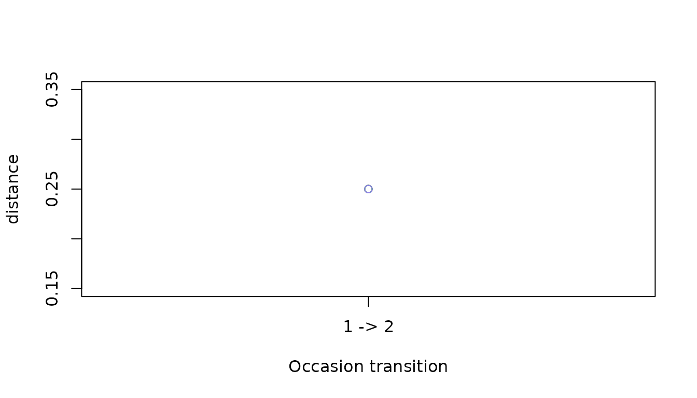

# Longitudinal and Panel Sequence Workflows

## Scope

Panel sequences are repeated ordered-state records from the same
independent unit. The workflow preserves the panel identifier, occasion,
sequence identity, and preprocessing decisions. Distance between
occasions is a structural change measure; it is not evidence of
learning, adaptation, or causality by itself.

## Synthetic data

``` r

base <- data.frame(
  participant_id = rep(paste0("p", 1:4), each = 8L),
  occasion = rep(rep(c(1, 2), each = 4L), times = 4L),
  sequence_id = rep(paste0("s", 1:8), each = 4L),
  sequence_order = rep(1:4, times = 8L),
  state = c(
    "A", "B", "C", "D", "A", "B", "D", "D",
    "A", "C", "C", "D", "A", "C", "D", "D",
    "D", "C", "B", "A", "D", "C", "A", "A",
    "D", "B", "B", "A", "D", "B", "A", "A"
  ),
  stringsAsFactors = FALSE
)
head(base)
#>   participant_id occasion sequence_id sequence_order state
#> 1             p1        1          s1              1     A
#> 2             p1        1          s1              2     B
#> 3             p1        1          s1              3     C
#> 4             p1        1          s1              4     D
#> 5             p1        2          s2              1     A
#> 6             p1        2          s2              2     B
```

## Prepare and audit the panel

``` r

panel <- prepare_sequence_panel(
  base,
  panel_id_col = "participant_id",
  occasion_col = "occasion"
)
panel$index
#>   sequence_id panel_id occasion occasion_rank sequence_length transition_count
#> 1          s1       p1        1             1               4                3
#> 2          s2       p1        2             2               4                3
#> 3          s3       p2        1             1               4                3
#> 4          s4       p2        2             2               4                3
#> 5          s5       p3        1             1               4                3
#> 6          s6       p3        2             2               4                3
#> 7          s7       p4        1             1               4                3
#> 8          s8       p4        2             2               4                3
```

A unique panel/occasion combination is required by default. This
prevents two sequences from being silently treated as the same repeated
observation.

## Summarise occasions and states

``` r

panel_summary <- summarise_sequence_panel(panel)
panel_summary$occasions
#>   occasion n_panels n_sequences mean_length median_length mean_transitions
#> 1        1        4           4           4             4                3
#> 2        2        4           4           4             4                3
head(panel_summary$states)
#>   occasion state occurrence_count occurrence_share sequence_count
#> 1        1     A                4            0.250              4
#> 2        1     B                4            0.250              3
#> 3        1     C                4            0.250              3
#> 4        1     D                4            0.250              4
#> 5        2     A                6            0.375              4
#> 6        2     B                2            0.125              2
#>   sequence_prevalence
#> 1                1.00
#> 2                0.75
#> 3                0.75
#> 4                1.00
#> 5                1.00
#> 6                0.50
```

## Quantify within-panel change

``` r

changes <- compare_sequence_panel_changes(
  panel,
  method = "levenshtein",
  normalise = "max_length"
)
changes
#>   panel_id from_sequence_id to_sequence_id from_occasion to_occasion from_rank
#> 1       p1               s1             s2             1           2         1
#> 2       p2               s3             s4             1           2         1
#> 3       p3               s5             s6             1           2         1
#> 4       p4               s7             s8             1           2         1
#>   to_rank distance length_change transition_change
#> 1       2     0.25             0                 0
#> 2       2     0.25             0                 0
#> 3       2     0.25             0                 0
#> 4       2     0.25             0                 0
```

Alternative distance methods use the same explicit arguments as
[`compute_sequence_distance()`](https://stefanosbalaskas.github.io/gp3sequences/reference/compute_sequence_distance.md).
The result compares consecutive occasions within each panel only.

``` r

plot_sequence_panel_changes(changes, metric = "distance", type = "individual")
```



``` r

plot_sequence_panel_changes(changes, metric = "distance", type = "summary")
```


## Reporting

Report the panel unit, occasion ordering, distance method,
normalisation, sequence counts at each occasion, and any missing
occasions. Treat change as a structural description unless a separate
design supports stronger inference.
