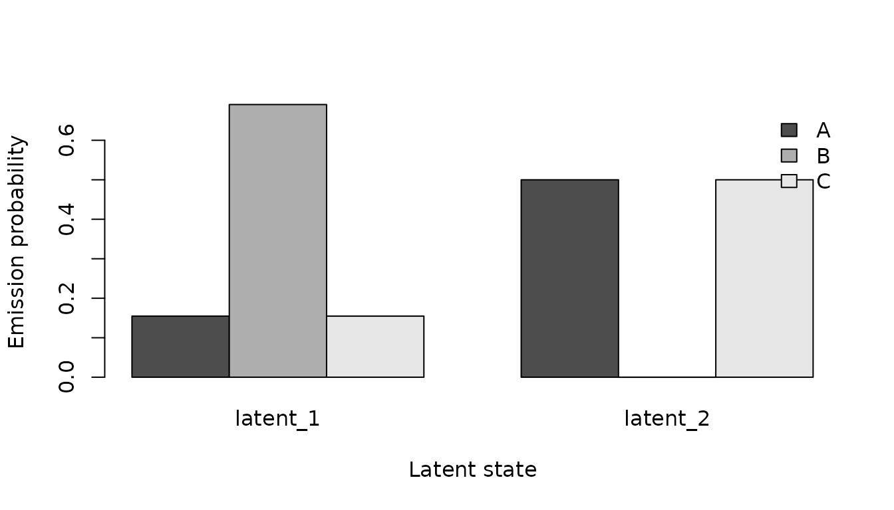

# Multichannel and Covariate-Dependent HMMs

## Scope and guardrails

Multichannel HMMs model several categorical observation channels through
a shared finite-state process. Covariate-dependent HMMs allow initial
and transition probabilities to vary with declared numeric covariates.
Latent states are statistical model states; labels should not be treated
as emotion, cognition, diagnosis, or causal mechanisms.

## Synthetic data

``` r

paths <- list(
  s1 = c("A", "A", "B", "B", "C"),
  s2 = c("A", "B", "B", "C", "C"),
  s3 = c("C", "C", "B", "B", "A"),
  s4 = c("C", "B", "B", "A", "A"),
  s5 = c("A", "A", "B", "C", "C"),
  s6 = c("C", "C", "B", "A", "A")
)
data <- do.call(rbind, lapply(seq_along(paths), function(i) {
  data.frame(
    sequence_id = names(paths)[i],
    sequence_order = seq_along(paths[[i]]),
    state = paths[[i]],
    context = c("x", "x", "y", "y", "z"),
    condition = as.integer(i > 3L),
    stringsAsFactors = FALSE
  )
}))
```

## Multichannel model

``` r

multi <- fit_multichannel_sequence_hmm(
  data,
  n_states = 2L,
  channel_cols = c("state", "context"),
  max_iter = 15L,
  seed = 2L
)
summarise_multichannel_sequence_hmm(multi)$fit
#>   n_states n_channels n_sequences n_observations log_likelihood      aic
#> 1        2          2           6             30      -54.43378 130.8676
#>        bic iterations converged
#> 1 146.2807         15     FALSE
head(decode_multichannel_sequence_states(multi))
#>   sequence_id sequence_order latent_state posterior_probability decoding_method
#> 1          s1              1     latent_2             1.0000000         viterbi
#> 2          s1              2     latent_2             0.8794941         viterbi
#> 3          s1              3     latent_1             1.0000000         viterbi
#> 4          s1              4     latent_1             1.0000000         viterbi
#> 5          s1              5     latent_2             0.9999783         viterbi
#> 6          s2              1     latent_2             1.0000000         viterbi
#>   state context
#> 1     A       x
#> 2     A       x
#> 3     B       y
#> 4     B       y
#> 5     C       z
#> 6     A       x
```

``` r

plot_multichannel_sequence_hmm(multi, channel = "state")
```



## Covariate-dependent model

``` r

covariate <- fit_covariate_sequence_hmm(
  data,
  n_states = 2L,
  initial_covariate_cols = "condition",
  transition_covariate_cols = "condition",
  max_iter = 10L,
  inner_maxit = 30L,
  seed = 3L
)
summarise_covariate_sequence_hmm(covariate)$fit
#>   n_states n_sequences n_observations log_likelihood      aic      bic
#> 1        2           6             30      -29.67882 79.35764 93.36961
#>   iterations converged optimizers_converged ridge
#> 1         10     FALSE                 TRUE 1e-06
predict_covariate_transition_probabilities(
  covariate,
  data.frame(condition = c(0, 1))
)
#>   row from_state to_state probability
#> 1   1   latent_1 latent_1   0.2432060
#> 2   1   latent_1 latent_2   0.7567940
#> 3   1   latent_2 latent_1   0.1281876
#> 4   1   latent_2 latent_2   0.8718124
#> 5   2   latent_1 latent_1   0.5231559
#> 6   2   latent_1 latent_2   0.4768441
#> 7   2   latent_2 latent_1   0.5798800
#> 8   2   latent_2 latent_2   0.4201200
head(decode_covariate_sequence_states(covariate))
#>   sequence_id sequence_order observed_state latent_state posterior_probability
#> 1          s1              1              A     latent_1             0.9999204
#> 2          s1              2              A     latent_1             0.6392483
#> 3          s1              3              B     latent_2             0.9931941
#> 4          s1              4              B     latent_2             0.9953192
#> 5          s1              5              C     latent_2             0.8284966
#> 6          s2              1              A     latent_1             0.9998787
#>   decoding_method
#> 1         viterbi
#> 2         viterbi
#> 3         viterbi
#> 4         viterbi
#> 5         viterbi
#> 6         viterbi
```

## Reporting

Report channel coding, state count, starting seed, convergence status,
log-likelihood history, AIC/BIC as descriptive criteria, covariate
scaling, and any sensitivity analyses. Multiple starts and simulation
recovery should be used before substantive interpretation.
