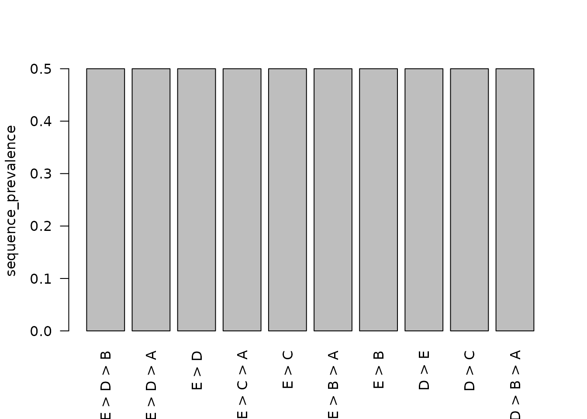

# Bounded Non-Contiguous Subsequence Mining

## Why bounded subsequences?

A non-contiguous subsequence preserves order while allowing intervening
states. The implementation requires explicit motif length, maximum gap,
maximum span, and combination limits. These constraints keep enumeration
auditable and avoid silently searching an unbounded combinatorial space.

## Synthetic sequences

``` r

sequences <- data.frame(
  sequence_id = rep(paste0("s", 1:6), each = 5L),
  sequence_order = rep(1:5, times = 6L),
  state = c(
    "A", "B", "C", "D", "E",
    "A", "C", "B", "D", "E",
    "A", "B", "D", "C", "E",
    "E", "D", "C", "B", "A",
    "E", "C", "D", "B", "A",
    "E", "D", "B", "C", "A"
  ),
  group = rep(rep(c("forward", "reverse"), each = 3L), each = 5L),
  stringsAsFactors = FALSE
)
```

## Enumerate occurrences

``` r

occurrences <- extract_sequence_subsequences(
  sequences,
  metadata_cols = "group",
  min_length = 2L,
  max_length = 3L,
  max_gap = 2L,
  max_span = 4L,
  repeated_state_policy = "preserve"
)
head(occurrences)
#>   sequence_id subsequence subsequence_length start_order end_order span
#> 1          s1       A > B                  2           1         2    1
#> 2          s2       A > B                  2           1         3    2
#> 3          s3       A > B                  2           1         2    1
#> 4          s1       A > C                  2           1         3    2
#> 5          s2       A > C                  2           1         2    1
#> 6          s3       A > C                  2           1         4    3
#>   max_observed_gap selected_positions selected_orders
#> 1                0                1,2             1,2
#> 2                1                1,3             1,3
#> 3                0                1,2             1,2
#> 4                1                1,3             1,3
#> 5                0                1,2             1,2
#> 6                2                1,4             1,4
attributes(occurrences)[c("n_sequences", "settings")]
#> $n_sequences
#> [1] 6
#> 
#> $settings
#> $settings$min_length
#> [1] 2
#> 
#> $settings$max_length
#> [1] 3
#> 
#> $settings$max_gap
#> [1] 2
#> 
#> $settings$max_span
#> [1] 4
#> 
#> $settings$repeated_state_policy
#> [1] "preserve"
#> 
#> $settings$separator
#> [1] " > "
#> 
#> $settings$max_combinations_per_sequence
#> [1] 100000
```

## Sequence-level prevalence

``` r

subsequence_summary <- summarise_sequence_subsequences(occurrences)
head(subsequence_summary, 10L)
#>    subsequence subsequence_length occurrence_count sequence_count
#> 1        A > B                  2                3              3
#> 2        A > C                  2                3              3
#> 3        A > D                  2                3              3
#> 4        B > A                  2                3              3
#> 5        B > C                  2                3              3
#> 6        B > D                  2                3              3
#> 7        B > E                  2                3              3
#> 8        C > A                  2                3              3
#> 9        C > B                  2                3              3
#> 10       C > D                  2                3              3
#>    sequence_prevalence mean_span median_span mean_max_gap
#> 1                  0.5  1.333333           1    0.3333333
#> 2                  0.5  2.000000           2    1.0000000
#> 3                  0.5  2.666667           3    1.6666667
#> 4                  0.5  1.333333           1    0.3333333
#> 5                  0.5  1.333333           1    0.3333333
#> 6                  0.5  1.333333           1    0.3333333
#> 7                  0.5  2.666667           3    1.6666667
#> 8                  0.5  2.000000           2    1.0000000
#> 9                  0.5  1.333333           1    0.3333333
#> 10                 0.5  1.333333           1    0.3333333

frequent <- filter_sequence_subsequences(
  subsequence_summary,
  min_sequences = 2L,
  min_prevalence = 0.25,
  top_n = 12L
)
frequent
#>    subsequence subsequence_length occurrence_count sequence_count
#> 1        A > B                  2                3              3
#> 2        A > C                  2                3              3
#> 3        A > D                  2                3              3
#> 4        B > A                  2                3              3
#> 5        B > C                  2                3              3
#> 6        B > D                  2                3              3
#> 7        B > E                  2                3              3
#> 8        C > A                  2                3              3
#> 9        C > B                  2                3              3
#> 10       C > D                  2                3              3
#> 11       C > E                  2                3              3
#> 12       D > A                  2                3              3
#> 13       D > B                  2                3              3
#> 14       D > C                  2                3              3
#> 15       D > E                  2                3              3
#> 16       E > B                  2                3              3
#> 17       E > C                  2                3              3
#> 18       E > D                  2                3              3
#> 19   A > B > D                  3                3              3
#> 20   A > B > E                  3                3              3
#> 21   A > C > E                  3                3              3
#> 22   A > D > E                  3                3              3
#> 23   B > D > E                  3                3              3
#> 24   D > B > A                  3                3              3
#> 25   E > B > A                  3                3              3
#> 26   E > C > A                  3                3              3
#> 27   E > D > A                  3                3              3
#> 28   E > D > B                  3                3              3
#>    sequence_prevalence mean_span median_span mean_max_gap
#> 1                  0.5  1.333333           1    0.3333333
#> 2                  0.5  2.000000           2    1.0000000
#> 3                  0.5  2.666667           3    1.6666667
#> 4                  0.5  1.333333           1    0.3333333
#> 5                  0.5  1.333333           1    0.3333333
#> 6                  0.5  1.333333           1    0.3333333
#> 7                  0.5  2.666667           3    1.6666667
#> 8                  0.5  2.000000           2    1.0000000
#> 9                  0.5  1.333333           1    0.3333333
#> 10                 0.5  1.333333           1    0.3333333
#> 11                 0.5  2.000000           2    1.0000000
#> 12                 0.5  2.666667           3    1.6666667
#> 13                 0.5  1.333333           1    0.3333333
#> 14                 0.5  1.333333           1    0.3333333
#> 15                 0.5  1.333333           1    0.3333333
#> 16                 0.5  2.666667           3    1.6666667
#> 17                 0.5  2.000000           2    1.0000000
#> 18                 0.5  1.333333           1    0.3333333
#> 19                 0.5  2.666667           3    0.6666667
#> 20                 0.5  4.000000           4    1.6666667
#> 21                 0.5  4.000000           4    1.6666667
#> 22                 0.5  4.000000           4    1.6666667
#> 23                 0.5  2.666667           3    0.6666667
#> 24                 0.5  2.666667           3    0.6666667
#> 25                 0.5  4.000000           4    1.6666667
#> 26                 0.5  4.000000           4    1.6666667
#> 27                 0.5  4.000000           4    1.6666667
#> 28                 0.5  2.666667           3    0.6666667
```

## Group comparison

``` r

comparison <- compare_sequence_subsequences(
  occurrences,
  group_col = "group",
  p_adjust = "holm"
)
head(comparison, 10L)
#>    subsequence subsequence_length   test statistic df p_value max_prevalence
#> 1        A > B                  2 fisher        NA NA     0.1              1
#> 2    A > B > D                  3 fisher        NA NA     0.1              1
#> 3    A > B > E                  3 fisher        NA NA     0.1              1
#> 4        A > C                  2 fisher        NA NA     0.1              1
#> 5    A > C > E                  3 fisher        NA NA     0.1              1
#> 6        A > D                  2 fisher        NA NA     0.1              1
#> 7    A > D > E                  3 fisher        NA NA     0.1              1
#> 8        B > A                  2 fisher        NA NA     0.1              1
#> 9        B > D                  2 fisher        NA NA     0.1              1
#> 10   B > D > E                  3 fisher        NA NA     0.1              1
#>    min_prevalence prevalence_range prevalence_forward n_forward
#> 1               0                1                  1         3
#> 2               0                1                  1         3
#> 3               0                1                  1         3
#> 4               0                1                  1         3
#> 5               0                1                  1         3
#> 6               0                1                  1         3
#> 7               0                1                  1         3
#> 8               0                1                  0         3
#> 9               0                1                  1         3
#> 10              0                1                  1         3
#>    prevalence_reverse n_reverse prevalence_difference p_adjusted
#> 1                   0         3                    -1          1
#> 2                   0         3                    -1          1
#> 3                   0         3                    -1          1
#> 4                   0         3                    -1          1
#> 5                   0         3                    -1          1
#> 6                   0         3                    -1          1
#> 7                   0         3                    -1          1
#> 8                   1         3                     1          1
#> 9                   0         3                    -1          1
#> 10                  0         3                    -1          1
```

The comparison is based on sequence-level presence, not occurrence
multiplicity. Adjusted p-values do not turn an observational grouping
into a causal design.

``` r

plot_sequence_subsequences(frequent, metric = "sequence_prevalence")
```



## Relation to specialist packages

The bounded enumerator is intentionally narrow. Large-scale frequent
sequence mining, event-sequence constraint systems, and
discriminating-subsequence algorithms remain appropriate uses of
specialist packages through explicit adapters.
