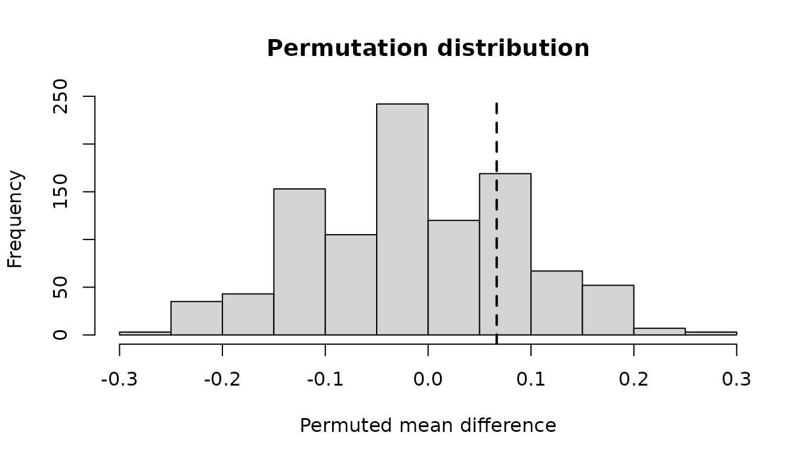
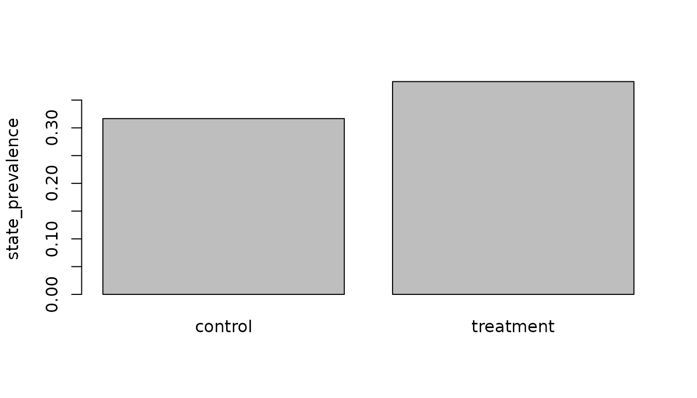

# Design-Aware Sequence Group Inference

## Why declare the design?

Sequence rows are rarely independent. The comparison API requires the
group column and independent unit, and can additionally record pairs or
assignment clusters. It aggregates the selected metric before
permutation or bootstrap resampling.

## Synthetic randomized groups

``` r

paths <- replicate(20, sample(c("A", "B", "C"), 6L, replace = TRUE), simplify = FALSE)
data <- do.call(rbind, lapply(seq_along(paths), function(i) {
  data.frame(
    participant_id = paste0("p", i),
    sequence_id = paste0("s", i),
    sequence_order = seq_along(paths[[i]]),
    state = paths[[i]],
    group = if (i <= 10L) "control" else "treatment",
    stringsAsFactors = FALSE
  )
}))
```

## Declare and test

``` r

design <- declare_sequence_comparison_design(
  group_col = "group",
  unit_col = "participant_id",
  design = "randomized"
)

result <- test_sequence_group_difference(
  data,
  design,
  metric = "state_prevalence",
  target_state = "A",
  n_permutations = 999L,
  seed = 10L
)
result$estimate
#>   group_1   group_2 mean_group_1 mean_group_2 difference_group_2_minus_group_1
#> 1 control treatment    0.3166667    0.3833333                       0.06666667
#>   p_value alternative n_permutations
#> 1   0.458   two.sided            999
```

Supported metrics are deliberately limited to transparent quantities:
sequence length, transition count, state prevalence, and declared
subsequence presence.

## Bootstrap interval

``` r

result <- bootstrap_sequence_group_difference(
  result,
  n_boot = 999L,
  level = 0.95,
  seed = 11L
)
summarise_sequence_group_inference(result)
#> $estimate
#>   group_1   group_2 mean_group_1 mean_group_2 difference_group_2_minus_group_1
#> 1 control treatment    0.3166667    0.3833333                       0.06666667
#>   p_value alternative n_permutations
#> 1   0.458   two.sided            999
#> 
#> $bootstrap_interval
#>   level      lower upper n_boot seed
#> 1  0.95 -0.1166667  0.25    999   11
#> 
#> $design
#>       design group_col       unit_col pair_col cluster_col
#> 1 randomized     group participant_id     <NA>        <NA>
#> 
#> $metric
#> [1] "state_prevalence"
#> 
#> $interpretation
#> [1] "Randomization-based contrast, conditional on valid assignment and study implementation."
```

``` r

plot_sequence_group_inference(result, type = "permutation")
```



``` r

plot_sequence_group_inference(result, type = "group_means")
```



## Causal language

For `design = "randomized"`, causal interpretation still depends on
valid assignment, implementation, attrition handling, and an estimand
consistent with the design. For `design = "observational"`, the output
explicitly describes an associational exchangeability-based contrast and
does not license causal claims.
