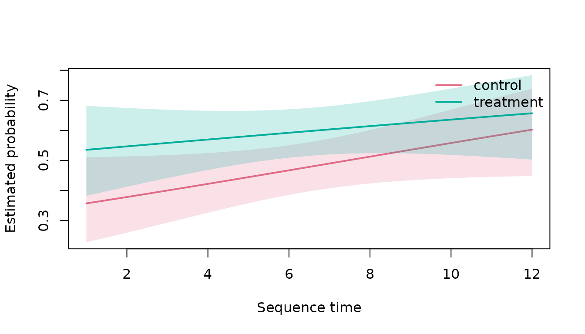

# Time-Varying Condition Comparisons

## Model target

[`fit_time_varying_sequence_model()`](https://stefanosbalaskas.github.io/gp3sequences/reference/fit_time_varying_sequence_model.md)
estimates the probability of a declared state or transition over aligned
sequence time. It uses group-specific smooths and can include a
participant random-effect smooth. The model concerns a predeclared
structural outcome, not an unobserved psychological state.

## Synthetic repeated sequences

``` r

set.seed(1)
participants <- paste0("p", 1:24)
x <- do.call(
  rbind,
  lapply(seq_along(participants), function(i) {
    time <- 1:12
    group <- if (i <= 12L) "control" else "treatment"
    linear <-
      -0.4 +
      0.06 * time +
      0.35 * (group == "treatment") * sin(time / 3)

    data.frame(
      participant_id = participants[i],
      sequence_id = participants[i],
      sequence_order = time,
      group = group,
      state = ifelse(
        stats::runif(length(time)) < stats::plogis(linear),
        "A",
        "B"
      ),
      stringsAsFactors = FALSE
    )
  })
)
```

## Fit and inspect

``` r

if (requireNamespace("mgcv", quietly = TRUE)) {
  model <- fit_time_varying_sequence_model(
    x,
    group_col = "group",
    participant_id_col = "participant_id",
    target_state = "A",
    k = 5L
  )
  model_summary <- summarise_time_varying_sequence_model(model)
  model_summary$metadata
  model_summary$parametric_terms
  model_summary$smooth_terms
}
#>                                   edf    Ref.df       Chi.sq    p-value
#> s(.time):.groupcontrol   1.0000070152  1.000014 3.4110320487 0.06476524
#> s(.time):.grouptreatment 1.0000046648  1.000009 0.8712217158 0.35062143
#> s(.participant)          0.0007846011 22.000000 0.0006886217 0.62618174
```

## Predictions

``` r

if (requireNamespace("mgcv", quietly = TRUE)) {
  predictions <- predict_time_varying_sequence_model(
    model,
    time = seq(1, 12, length.out = 60L),
    level = 0.95
  )
  head(predictions)
}
#>       time   group  estimate     lower     upper outcome
#> 1 1.000000 control 0.3572934 0.2283391 0.5108610   state
#> 2 1.186441 control 0.3612081 0.2340796 0.5112900   state
#> 3 1.372881 control 0.3651413 0.2398916 0.5117573   state
#> 4 1.559322 control 0.3690926 0.2457709 0.5122658   state
#> 5 1.745763 control 0.3730615 0.2517130 0.5128189   state
#> 6 1.932203 control 0.3770476 0.2577129 0.5134199   state
```

``` r

if (requireNamespace("mgcv", quietly = TRUE)) {
  plot_time_varying_sequence_model(model)
}
```



## Transition outcomes

Use `outcome = "transition"` together with `from_state` and `to_state`
to model a predeclared transition. The time coordinate refers to the
origin position.

## Interpretation

Pointwise intervals describe uncertainty conditional on the fitted
model. A time-varying association is not automatically a causal
condition effect. Causal language requires valid assignment,
implementation, estimand definition, and an analysis aligned with the
experimental design.
