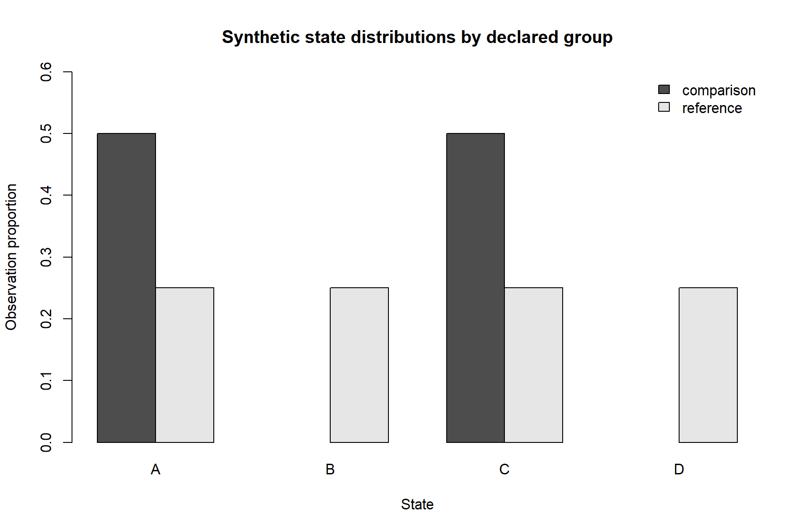
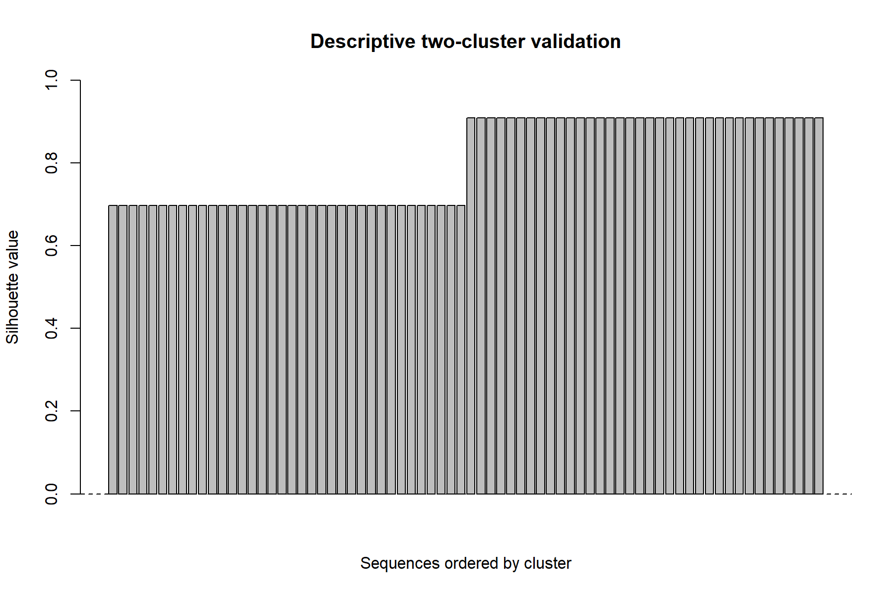
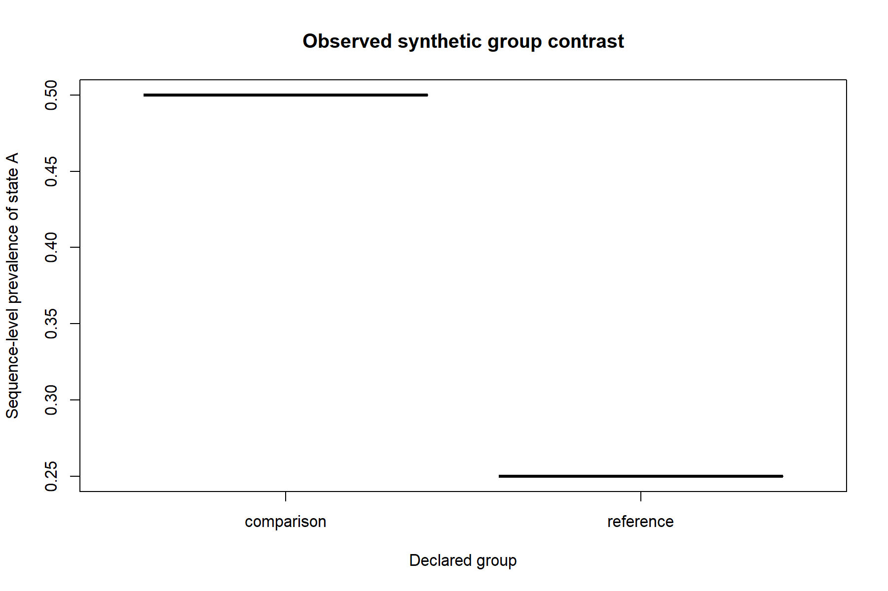

```{r setup, include=FALSE}
knitr::opts_chunk$set(
  echo = TRUE,
  message = FALSE,
  warning = FALSE,
  fig.path = "figures/"
)
options(width = 80)
```

# Introduction

Ordered categorical sequences are used to represent state histories,
behavioral paths, event streams, interaction traces, and other processes in
which order matters. Existing R software provides strong specialist methods,
but applied workflows can become fragmented across data representations,
preprocessing conventions, model-specific outputs, and reporting practices.

This article presents `gp3sequences`, an integration and audit layer for
ordered categorical sequence analysis. Its contribution is not a claim to
replace specialist software. Instead, it provides a common long-format data
contract, explicit preparation policies, consistent result structures,
machine-readable diagnostics, interpretation boundaries, guarded adapters,
and provenance comparison across analytical families.

# Design goals and scope

The package is organized around five design goals: neutral data input,
explicit analytical decisions, deterministic and inspectable computation,
consistent structured outputs, and cautious interpretation. Structural
sequence results are not automatically treated as psychological constructs,
behavioral mechanisms, or causal effects.

The public API covers validation and preparation, descriptive summaries,
motif and subsequence extraction, dissimilarities, clustering, transition
networks, latent-state models, longitudinal comparisons, time-varying
models, declared-design inference, and analysis auditing.

# Package architecture

## Data contract

The primary interface uses ordinary long-format data frames with explicit
sequence identifiers, within-sequence order, and categorical states. This
keeps raw observations inspectable and permits preparation decisions to be
recorded before conversion to specialist representations.

## Analysis contracts and provenance

Analysis objects retain settings, capabilities, diagnostics, and
interpretation boundaries. These fields allow related results to be checked
and compared without assuming that outputs from different analytical
families are interchangeable.

# Integrated workflow

The intended workflow begins with validation and audit, proceeds through
explicit preparation and fit-for-purpose analysis, and ends with result
auditing and provenance comparison.

```{r workflow-plan}
workflow <- read.csv("data/case-study-workflow.csv", stringsAsFactors = FALSE)
knitr::kable(
  workflow[, c(
    "stage",
    "manuscript_step",
    "gp3sequences_functions",
    "scaffold_status"
  )],
  caption = "Integrated evaluated case-study workflow."
)
```

# Software comparison

The comparison is based on documented software purpose rather than raw
function counts. A capability classified as `not_documented` was not found in
the reviewed primary sources; this is not proof that every package version
lacks that capability. A classification of `outside_scope` records a mismatch
between the comparison dimension and a package's specialist purpose.

```{r software-comparison}
comparison <- read.csv("data/software-comparison.csv", check.names = TRUE)
knitr::kable(
  comparison[, c(
    "Package",
    "Primary.contribution",
    "Relationship.to.gp3sequences",
    "Comparison.boundary"
  )],
  caption = "Primary-source-backed positioning of gp3sequences and specialist comparators."
)
```

# Reproducible case study

## Data and declared design

The scaffold includes a deterministic synthetic data set with 72 sequences,
24 ordered observations per sequence, four categorical states, and two
declared groups. It is intended to support a compact end-to-end example
without embedding private or proprietary data in the manuscript.

```{r case-data}
case_data <- read.csv("data/case-study-sequences.csv", stringsAsFactors = FALSE)
stopifnot(
  nrow(case_data) == 72L * 24L,
  length(unique(case_data$sequence_id)) == 72L,
  setequal(unique(case_data$state), c("A", "B", "C", "D"))
)

knitr::kable(
  utils::head(case_data, 12L),
  caption = "First observations in the deterministic synthetic case study."
)
```

## Validation and explicit preparation

The synthetic input was evaluated against the neutral long-format contract
before analysis. Preparation preserved all rows and consecutive repeats while
recording every resolved policy. Review-severity diagnostics are reported as
structural properties rather than silently removed.

```{r evaluated-validation}
validation_result <- read.csv("results/case-study/validation-summary.csv")
preparation_result <- read.csv("results/case-study/preparation-decisions.csv")
knitr::kable(
  validation_result,
  caption = "Validation status for the deterministic case-study data."
)
knitr::kable(
  preparation_result,
  caption = "Explicit preparation decisions applied before analysis."
)
```

## State and transition structure

The two declared groups were designed to differ structurally. Comparison
sequences alternate primarily between states A and C, whereas reference
sequences distribute observations across all four states. These differences
are properties of the deterministic generator and are not estimates of an
external population.

```{r evaluated-states, fig.alt="Grouped bars show equal A and C proportions in comparison sequences and equal A, B, C, and D proportions in reference sequences."}
state_result <- read.csv("results/case-study/state-summary-by-group.csv")
knitr::kable(
  state_result,
  digits = 3,
  caption = "State frequencies and proportions by declared synthetic group."
)

```

```{r evaluated-transitions}
transition_result <- read.csv("results/case-study/transition-summary-by-group.csv")
transition_top <- transition_result[
  order(
    transition_result$group,
    -transition_result$n_transitions,
    transition_result$from_state,
    transition_result$to_state
  ),
]
transition_top <- do.call(
  rbind,
  lapply(split(transition_top, transition_top$group), utils::head, 6L)
)
knitr::kable(
  transition_top,
  digits = 3,
  caption = "Most frequent adjacent transitions within each synthetic group."
)
```

## Recurring motifs and bounded subsequences

Contiguous motifs of lengths two and three and bounded noncontiguous
two-state subsequences were extracted using declared search limits. Reported
prevalence denotes structural recurrence across synthetic sequences; it is
not a significance test or a substantive mechanism.

```{r evaluated-patterns}
motif_result <- read.csv("results/case-study/motif-summary-by-group.csv")
subsequence_result <- read.csv("results/case-study/subsequence-summary-by-group.csv")
motif_top <- do.call(
  rbind,
  lapply(split(motif_result, motif_result$group), utils::head, 5L)
)
subsequence_top <- do.call(
  rbind,
  lapply(split(subsequence_result, subsequence_result$group), utils::head, 5L)
)
knitr::kable(
  motif_top,
  digits = 3,
  caption = "Most prevalent contiguous motifs within each synthetic group."
)
knitr::kable(
  subsequence_top,
  digits = 3,
  caption = "Most prevalent bounded noncontiguous subsequences."
)
```

## Dissimilarity and descriptive clustering

Normalized Levenshtein dissimilarities were clustered hierarchically with a
predeclared two-cluster solution. Silhouette and separation metrics are used
as descriptive diagnostics. They do not establish latent classes or recover
substantive types beyond the deterministic construction.

```{r evaluated-clustering, fig.alt="Silhouette bars are positive for all 72 sequences and indicate strong separation in the predeclared two-cluster solution."}
distance_result <- read.csv("results/case-study/distance-summary.csv")
cluster_result <- read.csv("results/case-study/cluster-validation.csv")
cluster_composition <- read.csv("results/case-study/cluster-composition.csv")
knitr::kable(
  distance_result,
  digits = 3,
  caption = "Pairwise normalized Levenshtein dissimilarity summary."
)
knitr::kable(
  cluster_result,
  digits = 3,
  caption = "Descriptive validation of the two-cluster solution."
)
knitr::kable(
  cluster_composition,
  digits = 3,
  caption = "Declared-group composition of the resulting clusters."
)

```

## Transition network and declared group contrast

A first-order directed transition network summarizes structural connectivity.
The group contrast was declared as observational and uses the sequence as the
independent unit. Its permutation p-value tests an exchangeability-based
association in the synthetic data; causal interpretation is explicitly
unsupported.

```{r evaluated-network-inference, fig.alt="Boxplots show a higher sequence-level prevalence of state A in the comparison group than in the reference group."}
centrality_result <- read.csv("results/case-study/transition-centrality.csv")
inference_result <- read.csv("results/case-study/group-inference.csv")
knitr::kable(
  centrality_result,
  digits = 3,
  caption = "Structural centrality in the pooled first-order transition network."
)
knitr::kable(
  inference_result,
  digits = 3,
  caption = "Declared observational contrast in sequence-level prevalence of state A."
)

```

## Reproducibility and interpretation boundary

All tables and figures in this section are regenerated by
`scripts/06-run-evaluated-case-study.R`. A manifest records file hashes,
row counts, package version, canonical content hashes, repository base commit, analysis-script hash, and the fixed analysis seed.
The evaluated workflow demonstrates package behavior under known synthetic
structure; it does not supply empirical evidence about people, behavior, or
causal processes.
# Discussion

The package addresses a practical gap between specialist analytical methods
and the requirements of transparent applied research. Its principal value is
workflow integration: data preparation, structural analysis, diagnostics,
interoperability, and reporting evidence remain connected through explicit
contracts and provenance.

The comparison also clarifies where delegation is preferable. TraMineR,
seqHMM, arulesSequences, WeightedCluster, ClickClust, PST, and march retain
distinct specialist roles. gp3sequences should therefore be evaluated by the
coherence and auditability of the integrated workflow rather than by a claim
to subsume all specialist methods.

# Limitations

The case study is deterministic and synthetic, so its numerical separation
reflects the known generator rather than sampling from an external
population. The evaluated workflow is intended to test integration,
reproducibility, diagnostics, and interpretation boundaries. Some specialist
capabilities remain available only through optional packages, and documented
absence in reviewed sources is not proof of feature nonexistence. Submission
also remains gated on a stable CRAN release matching the version described
in the article.
# Reproducibility statement

All manuscript data, scripts, comparison evidence, and generated results are
stored under the package repository's excluded `paper/` workspace. The
submitted article will include the code and data required to reproduce every
reported table and figure. Package and environment information will be
refreshed immediately before submission.

# Acknowledgements

Acknowledgements will be completed before submission.
